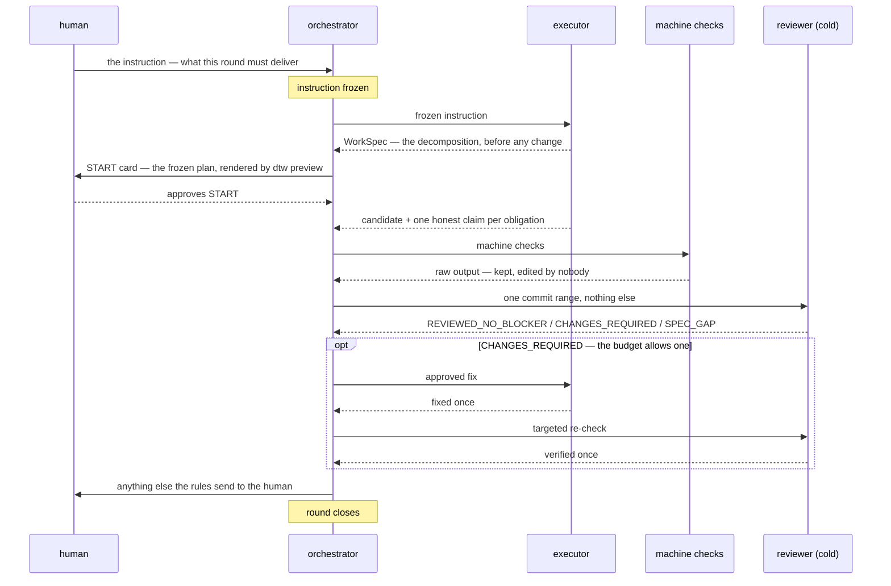

# do-the-work


**English** · [简体中文](README.zh-CN.md)

**An instrument with one first purpose: the work it ships is correct.** It is built for work
whose correctness no compiler, type checker or test suite can decide. It is not a linter and not
a writing assistant: it is a harness that freezes the instruction before the work starts, keeps
the person doing the work from also certifying it, runs machine checks whose output nobody
edits, and ends in a verdict from a reviewer who was handed one commit and nothing else. The
procedure in it — roles, rounds, budgets — is not the point; it is the minimum machinery that
keeps the harness itself intact, and it is kept to the smallest scope that does.

The problem it is built against is simple, and otherwise hard to avoid: whoever produced a piece
of work is the worst possible judge of whether it is done, and every informal process eventually
lets them be the judge anyway — by summarising their own evidence, by choosing which checks
count, or by being the only one who read the requirement. This harness takes those three moves
away.

**Contents:**
[Who it is for](#who-it-is-for) ·
[What using it looks like](#what-using-it-looks-like) ·
[Quickstart](#quickstart--mounting-it-in-a-repository-that-has-never-seen-it) ·
[Layout](#layout) ·
[State of this repository](#state-of-this-repository--run-these-do-not-trust-a-sentence) ·
[Install](#install) ·
[Reading order](#reading-order)

## Who it is for

Work that is **not pure code development** — work whose quality no conventional program
validation can check. A compiler refuses a wrong program and a test suite refuses a wrong
change; nothing refuses a wrong thesis chapter, specification, regulatory submission, or
client-audited report. That is the gap this harness covers. It is useful when three things are
true: the work is text, "done" is contestable, and there is a reason to be able to prove later
what was asked, what was delivered, and who signed it off.

It is **not** for source code review — code has cheaper validators, and a code reviewer — and it
is not a project-management tool. It has no server, no account, no telemetry, and nothing to log
into. The whole of it is a Python CLI, a set of git hooks, and a body of instruction text that a
repository mounts as a submodule and pins to a revision; a repository that mounts it is called
the **caller** below.

## What using it looks like

Three roles, and the discipline is that **they are three different sessions**. Independent is the
norm; a round that merges the two work-side roles is the exception, disclosed rather than silent.

| role | does | may never do |
|---|---|---|
| **orchestrator** | starts the work, dispatches the review, keeps the budget, carries questions to the human | review its own round's work, or answer a question the rules send to the human |
| **executor** | writes the candidate and one honest claim per obligation | write any check result, any verdict, or the decision |
| **reviewer** | starts cold from one commit SHA, derives everything else from the repository, writes the record | be handed a summary — a fact you were handed is a fact you did not check |

A round, as a sequence:



The budget is deliberately small — one full review, at most one approved fix, one targeted
re-check — because an unbounded review loop is how a process stops being a gate.

The harness runs this on itself. Every rule in it was paid for by something that went wrong,
which is why the instruction text keeps citing incidents rather than principles.

## Quickstart — mounting it in a repository that has never seen it

Five commands stand between a repository that has never seen this harness and one where the
guard actually fires: install the two runtime dependencies, mount this repo as a pinned
submodule, let `dtw init` create the instance files, put a pre-commit hook script into your
tree, and point git at it.

One convention: `python` means whichever of `python3` / `python` your machine runs — and if it
has both, see the note in the onboarding file, because they can resolve differently.

```sh
# 0. runtime dependencies
python -m pip install "jsonschema>=4.18" referencing

# 1. mount the instrument, pinned to a revision
git submodule add https://github.com/Melclycj/do-the-work.git <mount-path>
git submodule status          # prints the pinned SHA and the mount path

# 2. create .harness/, its ignore entry, harness.json, and the two instance files
python <mount-path>/tooling/dtw.py init --repo-root .

# 3. a pre-commit hook script in YOUR tree, committed executable
mkdir .githooks
cat > .githooks/pre-commit <<'HOOK'
#!/bin/sh
# python3 first, python second; the candidate must actually run (see the onboarding file)
PY=python3; "$PY" -c "pass" >/dev/null 2>&1 || PY=python
for CHK in <mount-path>/tooling/hooks/candidate_path_check.py \
           <mount-path>/tooling/hooks/review_freeze_check.py; do
  if [ ! -f "$CHK" ]; then
    echo "pre-commit: $CHK is missing — the mount is not initialised"; exit 1
  fi
  "$PY" "$CHK" || exit 1
done
HOOK
git add .githooks/pre-commit
git update-index --chmod=+x .githooks/pre-commit
git ls-files -s .githooks/pre-commit    # must print 100755 — without the x-bit git skips it

# 4. tell git to run hooks from there
git config core.hooksPath .githooks

# 5. prove the guard fires, rather than believing it does:
#    name a file that does not exist in something you commit, and watch it refuse
```

Two git facts explain the shape of steps 3 and 4. `dtw init` does not write the hook for you —
it prints that it does not — so the script is yours to commit. And git only runs hooks from the
directory `core.hooksPath` names; that config is per-checkout, so a clone carries the hook file
but not the wiring, and step 4 must be repeated in every fresh checkout.

That is the mechanical half of onboarding — six of ten items. The intended way to run the
whole walk is to hand [`document-harness/ONBOARDING.md`](document-harness/ONBOARDING.md) to
your agent: it carries all ten items in order, each with its command, how you see it took,
and which rule owns it, and it is written for a session that starts knowing nothing.

The other four items are judgment. Three are files whose content only you can decide; the
fourth, the journal, fills itself once rounds run:

- **The policy file** — a prose file, any name, any path, that tells the orchestrator what
  *this machine* does with a round's conclusions. Write four things into it: where the
  conclusions come from (command output), which ledgers get written, where rulings and
  unresolved findings go at closeout, and which mechanical checks your repository runs. The
  orchestrator reads it at closeout and acts on it without asking; harness code never
  executes it. Not having one is legal — the absence is stated at closeout, not papered over
  by inventing policy.
- **The ledger** — where you record what you did with a round's conclusions, in whatever form
  your repository already keeps durable state. No template is shipped, deliberately: that
  record is the caller's business, not the instrument's. Its location and rules are declared
  in the policy file.
- **The pointer** — one line in your agent-facing entry file (`CLAUDE.md`, `AGENTS.md`, or
  whatever plays that role) naming the policy file. One line is enough, e.g.:
  `Harness policy: see HARNESS-POLICY.md — what this repository does with a review round's
  conclusions.` The test: a session that starts cold in your repository must reach the policy
  file by reading only the entry file.
- **The journal** — not yours to author. Once the harness runs rounds it accumulates on its
  own: one file per round, holding that round's analysis and measurement. `dtw init` does not
  pre-create it, and nothing needs to.

Every command above was run end to end against a fresh repository on 2026-08-24; the walk
records are in
[`document-harness/journal/submod-hookenv-2026-08-24.md`](document-harness/journal/submod-hookenv-2026-08-24.md)
and
[`document-harness/journal/stranger-proof-walk-2026-08-24.md`](document-harness/journal/stranger-proof-walk-2026-08-24.md).

## Layout

Everything sits at the repository root: `document-harness/` (the instruction layer — the nine
paths rule `E10` fixes — and its records), `tooling/`, `schema/`, `contract/`,
`migration/`, `assurance/`, and the governance registers beside this file.

Two things to know before reading history here:

- Until round `DE-PREFIX` (2026-08-20) everything sat under a `ResearchSystem/` prefix;
  `git log --follow` crosses the rename.
- The repository a command *targets* is never guessed from depth or cwd (round
  `STRANGER-GUARDS`): it is the git toplevel of where the command is pointed, or a loud
  refusal — never a wrong root taken quietly.

## State of this repository — run these, do not trust a sentence

This section answers questions about the repository's current state — does the suite pass, is
the hook wired, what does the CLI have. It answers them with commands instead of sentences: a
written answer goes stale the day something changes and keeps sounding true, and this README
got that wrong often enough that the policy is now fixed — the table maps each question to the
command that answers it, and the text never states the answer.

In the intended use you do not run these yourself. The orchestrator is the human's interface:
ask it the question in plain language, and it runs the command and shows you the raw output.
The commands are printed so the answer never has to be taken from anyone's sentence — the
orchestrator's included; agents checking up on this README run them directly.

One convention: `python` below means whichever of `python3` / `python` this platform actually
runs — stock Ubuntu ships only `python3`, Windows typically `python`, and when both are present
they need not be the same interpreter (the hook probes `python3` first; both facts measured
2026-08-23/24). Substitute accordingly; `.githooks/pre-commit` picks its own interpreter by
probing.

| Question | Command |
|---|---|
| Does the suite pass? | `python -m pytest -q` |
| Why does a test fail? | `python -m pytest -q --tb=line` |
| Do the instruction layer's nine members resolve here? | `python -c "import sys,pathlib; sys.path.insert(0,'tooling'); from hooks import layer_path_check as L; print([m for m in L.LAYER if not pathlib.Path(m).exists()])"` |
| Do the pre-commit guards bind? | stage a path that resolves nowhere into an instruction-layer file, then run each of `tooling/hooks/{layer_path_check,candidate_path_check,review_freeze_check}.py` and read the exit codes |
| Is a hook wired in THIS checkout? | `git config --get core.hooksPath` — exit 1 means nothing runs, whatever the tree carries; then `ls .githooks/pre-commit` for what would run |
| How do I onboard a repository that has never seen this? | `document-harness/ONBOARDING.md` — ten items, each with its command, its check, and the rule that owns it |
| Is there a CLI? | `ls tooling/dtw.py`; `python tooling/dtw.py --help` lists its commands — a count written here went stale twice (rider `RA` in [`HARNESS-RIDERS.md`](HARNESS-RIDERS.md)), so none is written |
| What do the CLI, the guards and the suite need? | Python ≥ 3.12 and `python -m pip install pytest "jsonschema>=4.18" referencing` — not the suite's alone: every `dtw` command and both caller-side guards import `jsonschema` too, so without it a wired hook fails every commit (measured 2026-08-24). The floor is measured, not decorative: Ubuntu 24.04's system jsonschema 4.10.3 fails 571 of these tests |
| Which files travelled and which stayed? | `document-harness/split-travel-manifest.md` — it carries the rule, not just the list |

What stays true of this repository regardless of when you read it:

- **The CLI is `tooling/dtw.py`** (alias `dtw`). What commands it has is `--help`'s answer,
  never this file's: two sentences here counted them and both went stale.
- **Guard wiring is per-machine, and that half is all of it.** Since 2026-08-19 this
  repository carries a tracked `.githooks/pre-commit` running the instruction layer's path
  check. A clone carries the file — it does not carry the one
  `git config core.hooksPath .githooks` that makes git run it — so every checkout starts with
  nothing running until that command. The caller side works the same way. Whether a hook is
  wired in the checkout you are reading is the table row above, not this paragraph.
- **`E10-sync` falls due whenever the membership sentence is touched** — `HD-22` (a ruling in
  [`HARNESS-DECISIONS.md`](HARNESS-DECISIONS.md), the decision log) made it a per-touch
  checklist item. The nine member paths are hard-coded in three places — the `E10` membership
  sentence in `document-harness/CONSTRUCTION-CHECKLIST.md`, the `LAYER` constant in
  `tooling/hooks/layer_path_check.py`, and the `EXPECTED` tuple in
  `tooling/tests/document_harness/test_precommit_checks.py`. Whether they resolve *today* is
  the third row of the table above; do not take this paragraph's word for it.
- **Licensed MIT** (`LICENSE`, user ruling 2026-08-23). The remote is whatever `git remote -v`
  prints in your checkout.

## Install

Today the five commands in the
[Quickstart](#quickstart--mounting-it-in-a-repository-that-has-never-seen-it) are the whole
installation: a pinned submodule, nothing from any registry. Packaging this as a plugin — one
command that mounts, pins and wires in a single step — is planned; it does not exist yet, and
until it does the submodule mount is the only supported path.

## Reading order

- [`document-harness/README.md`](document-harness/README.md) — the instrument's own navigation
  surface.
- [`document-harness/EXECUTION.md`](document-harness/EXECUTION.md) and
  [`REVIEW.md`](document-harness/REVIEW.md) — the two role instructions.
- [`document-harness/CONSTRUCTION-CHECKLIST.md`](document-harness/CONSTRUCTION-CHECKLIST.md) —
  the `E`-rules a construction batch runs under.
- [`HARNESS-DECISIONS.md`](HARNESS-DECISIONS.md) — the decision log; its `§live` section is
  required reading before opening a round.
- [`document-harness/split-travel-manifest.md`](document-harness/split-travel-manifest.md) —
  exactly which files travelled here and which stayed with the caller, with the rule that
  decided each.
- [`document-harness/ONBOARDING.md`](document-harness/ONBOARDING.md) — if you are a repository
  that has never used this harness, start there instead: ten items, in order, each with how
  you see it took.
