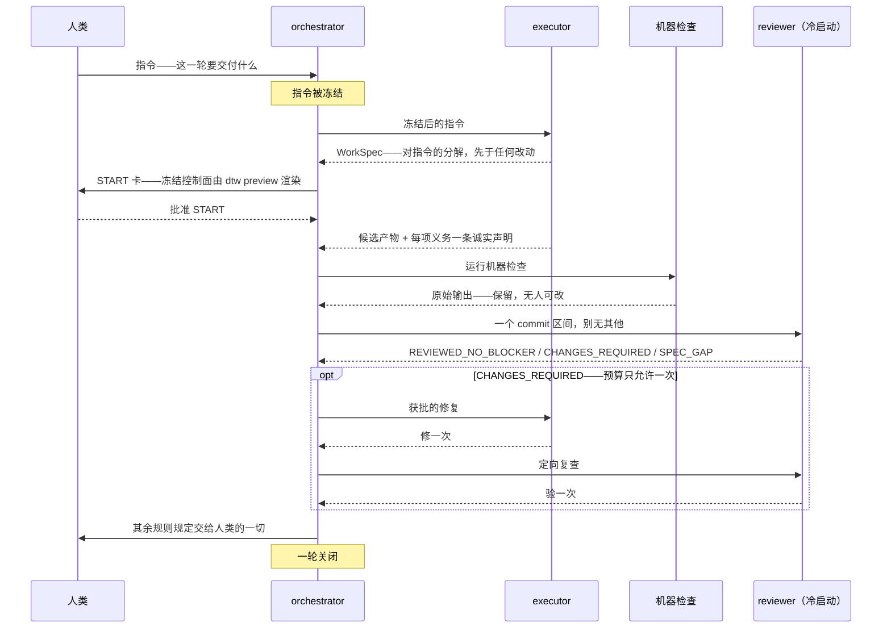

# do-the-work


[English](README.md) · **简体中文**

> 本文是英文版 [README.md](README.md) 的中文翻译，与英文版同步于 2026-08-24。两版不一致时，以英文版为准。

**这里装的是一件仪器（instrument），它的第一宗旨只有一个：交付出去的工作是正确的。** 它为
那些编译器、类型检查器、测试套件都无法裁定正确性的工作而造。它不是 linter，也不是写作
助手：它是一套 harness——在工作开始前冻结指令；不让做工作的人同时为工作作保；运行输出
无人可编辑的机器检查；最后由一位只拿到一个 commit、别无其他的 reviewer 给出判定。其中的
流程——角色、轮、预算——本身不是目的；它们是维持这套 harness 自身成立的最小机器，并且
被刻意压在能成立的最小范围内。

它针对的问题很简单、且否则难以避免：一件工作的产出者，是「这件工作做完了没有」最糟糕的
裁判；而每一个非正式流程最终都会让产出者当上这个裁判——通过总结自己的证据、通过挑选哪些
检查算数、或者通过成为唯一读过需求的人。这套 harness 把这三条路全部拿掉。

**目录：**
[适用对象](#适用对象) ·
[用起来是什么样](#用起来是什么样) ·
[快速上手](#快速上手挂载到一个从未见过它的仓库) ·
[目录结构](#目录结构) ·
[仓库状态](#仓库状态跑命令别信句子) ·
[安装](#安装install) ·
[阅读顺序](#阅读顺序)

## 适用对象

**非纯代码开发**的工作场景——常规 program validation 检查不了产物质量的地方。编译器会
拒绝一个错误的程序，测试套件会拒绝一个错误的改动；却没有任何东西会拒绝一章写错的学位
论文、一份写错的规格说明、一份写错的监管申报、或一份客户要审计的报告。这套 harness 补的
就是这个缺口。当三件事同时成立时它才有用：工作本身是文本；「做完了」是有争议的；并且有
理由在事后能够证明——当初要求了什么、交付了什么、谁签的字。

它**不**用于源代码评审——代码有更便宜的验证器，也有 code reviewer——它也不是项目管理
工具。它没有服务器、没有账号、没有遥测、没有任何要登录的东西。它的全部就是：一个 Python
CLI、一组 git hooks、以及一批指令文本——由一个仓库以 submodule 方式挂载并 pin 到某个
revision；下文把挂载它的仓库称为**调用方（caller）**。

## 用起来是什么样

三个角色，而纪律在于**它们是三个不同的 session**。各自独立是常态；把两个工作侧角色合并进
同一轮是例外——例外要公开声明，而不是悄悄发生。

| 角色 | 做什么 | 永远不许做什么 |
|---|---|---|
| **orchestrator** | 启动工作、派发评审、掌管预算、把问题带给人类 | 评审自己这一轮的工作，或替人类回答规则规定该由人类回答的问题 |
| **executor** | 写候选产物（candidate），并对每项义务写一条诚实的声明 | 写任何检查结果、任何判定、任何决定 |
| **reviewer** | 从一个 commit SHA 冷启动，其余一切从仓库自行推导，写下评审记录 | 接受任何转述的摘要——别人递给你的事实，就是你没有核实过的事实 |

一轮（round）的时序：



预算刻意压小——一次完整评审、至多一次获批的修复、一次定向复查——因为无界的评审循环，
正是一个流程不再成其为门禁的方式。

这套 harness 用它自己管自己。它里面的每条规则都是由某次真实出过的错换来的，这也是为什么
指令文本反复引用的是事故（incident），而不是原则。

## 快速上手——挂载到一个从未见过它的仓库

从一个从未见过这套 harness 的仓库，到守卫真的会拦 commit 的仓库，中间隔着五条命令：装两个
运行时依赖、把本仓库挂载为 pin 住版本的 submodule、用 `dtw init` 生成实例文件、往你的树里
放一个 pre-commit hook 脚本、再把 git 指向它。

一个约定：`python` 指你机器上 `python3` / `python` 中实际能跑的那一个——如果两个都有，
见 onboarding 文件里的注记，因为它们可能解析到不同的解释器。

```sh
# 0. runtime dependencies
python -m pip install "jsonschema>=4.18" referencing

# 1. mount the instrument, pinned to a revision
git submodule add https://github.com/Melclycj/do-the-work.git <mount-path>
git submodule status          # prints the pinned SHA and the mount path

# 2. create .harness/, its ignore entry, and the two instance files
python <mount-path>/tooling/dtw.py init --repo-root .

# 3. a pre-commit hook script in YOUR tree, committed executable
mkdir .githooks
cat > .githooks/pre-commit <<'HOOK'
#!/bin/sh
# python3 first, python second; the candidate must actually run (see the onboarding file)
PY=python3; "$PY" -c "pass" >/dev/null 2>&1 || PY=python
for CHK in <mount-path>/tooling/hooks/candidate_path_check.py \
           <mount-path>/tooling/hooks/review_freeze_check.py; do
  if [ ! -f "$CHK" ]; then
    echo "pre-commit: $CHK is missing — the mount is not initialised"; exit 1
  fi
  "$PY" "$CHK" || exit 1
done
HOOK
git add .githooks/pre-commit
git update-index --chmod=+x .githooks/pre-commit
git ls-files -s .githooks/pre-commit    # must print 100755 — without the x-bit git skips it

# 4. tell git to run hooks from there
git config core.hooksPath .githooks

# 5. prove the guard fires, rather than believing it does:
#    name a file that does not exist in something you commit, and watch it refuse
```

第 3、4 步长成这样，由两个 git 事实决定。`dtw init` 不会替你写 hook——它会明说自己不写
——所以这个脚本要你自己写进树里、提交进去。而 git 只从 `core.hooksPath` 指定的目录运行
hook；这条 config 是每个 checkout 各自的，clone 带得走 hook 文件、带不走这根线，所以每个
新 checkout 都要重跑第 4 步。

以上是 onboarding 的机械一半——九项里的五项。走完整套流程的预期方式，是把
[`document-harness/ONBOARDING.md`](document-harness/ONBOARDING.md) 交给你的 agent：九项按
顺序全在里面，每项带它的命令、带「如何看到它生效」、带归属的规则——整份文件就是写给一个
冷启动、对这套 harness 一无所知的 session 执行的。

剩下四项是判断项。前三项是内容只能由你决定的文件；第四项 journal 会在轮跑起来后自己
积累：

- **policy 文件**——一份散文体文件，路径、文件名随意，作用是告诉 orchestrator：*这台
  机器*怎么处置一轮的结论。往里写四件事：结论从哪里来（命令输出）、要写哪些 ledger、
  收尾时裁决和未决 findings 归到哪里、你的仓库自己跑哪些机械检查。orchestrator 在收尾时
  读它、照它行事而不必再问你；harness 代码永远不执行它。没写也合法——收尾时如实说明
  缺失，而不是替你编一份出来。
- **ledger**——记录「你把一轮的结论拿去做了什么」的地方，用你仓库本来就有的持久化形式
  即可。刻意不提供模板：这份记录是调用方自己的事，不是仪器的事。它的位置和规则声明在
  policy 文件里。
- **入口指针**——在你的 agent 入口文件（`CLAUDE.md`、`AGENTS.md` 或起同样作用的文件）里
  加一行，指名 policy 文件。一行就够，例如：`Harness 政策见 HARNESS-POLICY.md——本仓库
  如何处置一轮评审的结论。` 检验标准：一个冷启动的 session 只读入口文件，就能找到
  policy 文件。
- **journal**——这份不用你写。harness 跑起轮之后它会自己积累：一轮一个文件，装着那一轮
  的分析与测量。`dtw init` 不预建它，也不需要任何人预建。

上面每条命令都于 2026-08-24 对一个全新仓库端到端跑过；实走记录在
[`document-harness/journal/submod-hookenv-2026-08-24.md`](document-harness/journal/submod-hookenv-2026-08-24.md)
和
[`document-harness/journal/stranger-proof-walk-2026-08-24.md`](document-harness/journal/stranger-proof-walk-2026-08-24.md)。

## 目录结构

一切都在仓库根部：`document-harness/`（指令层——`E10` 规则固定的那九个路径——及其记录）、
`tooling/`、`schema/`、`contract/`、`migration/`、`assurance/`，以及与本文件并排的治理
登记簿。

在这里读历史之前，有两件事值得先知道：

- 直到轮 `DE-PREFIX`（2026-08-20）之前，一切都在 `ResearchSystem/` 前缀之下；
  `git log --follow` 能跨过这次改名。
- 一条命令所*指向*的仓库从不靠目录深度或 cwd 猜测（轮 `STRANGER-GUARDS`）：要么是命令
  所指位置的 git toplevel，要么大声拒绝——绝不悄悄取一个错误的根。

## 仓库状态——跑命令，别信句子

这一节回答关于仓库当前状态的问题——测试套件过不过、hook 接没接、CLI 有什么。它用命令而
不是句子来回答：写死的答案在情况变化的当天就过期了，却还继续显得像真的；本 README 在这
上面栽过足够多次，于是规矩定死——下表把每个问题映射到能回答它的命令，正文永远不直接写
答案。

在预期用法里，这些命令不用你自己跑。orchestrator 就是人类的 interface：用自然语言问它
问题，它跑命令、给你看原始输出。命令印在这里，是为了答案永远不必来自任何人的转述——
包括 orchestrator 的转述；核查本 README 的 agents 则直接跑它们。

一个约定：下面的 `python` 指这个平台实际能跑的 `python3` / `python` 中的那一个——原生
Ubuntu 只带 `python3`，Windows 通常是 `python`；两个都在时它们未必是同一个解释器（hook
的探测先取 `python3`；两个事实均为 2026-08-23/24 实测）。请相应替换；
`.githooks/pre-commit` 靠探测自行选择解释器。

| 问题 | 命令 |
|---|---|
| 测试套件过吗？ | `python -m pytest -q` |
| 某个测试为什么挂？ | `python -m pytest -q --tb=line` |
| 指令层九个成员在这里都解析得到吗？ | `python -c "import sys,pathlib; sys.path.insert(0,'tooling'); from hooks import layer_path_check as L; print([m for m in L.LAYER if not pathlib.Path(m).exists()])"` |
| pre-commit 守卫真的咬合吗？ | 往一个指令层文件里 stage 一个哪里都解析不到的路径，然后分别运行 `tooling/hooks/{layer_path_check,candidate_path_check,review_freeze_check}.py`，读退出码 |
| 这个 checkout 里接了 hook 吗？ | `git config --get core.hooksPath`——退出码 1 意味着无论树里带着什么，都没有东西在跑；再 `ls .githooks/pre-commit` 看接上之后会跑的是什么 |
| 一个从没见过这套东西的仓库怎么 onboard？ | `document-harness/ONBOARDING.md`——九项，每项带它的命令、它的核验方式、以及归属的规则 |
| 有 CLI 吗？ | `ls tooling/dtw.py`；`python tooling/dtw.py --help` 列出它的命令——写在这里的命令数过期过两次（rider `RA`，见 [`HARNESS-RIDERS.md`](HARNESS-RIDERS.md)），所以这里不写数 |
| CLI、守卫和测试套件需要什么？ | Python ≥ 3.12 和 `python -m pip install pytest "jsonschema>=4.18" referencing`——不只是测试套件需要：每个 `dtw` 命令和两个调用方侧守卫也都 import `jsonschema`，缺了它，接好的 hook 会让每次 commit 都失败（2026-08-24 实测）。这个下限是量出来的，不是摆设：Ubuntu 24.04 系统自带的 jsonschema 4.10.3 会挂掉其中 571 个测试 |
| 哪些文件迁来了、哪些留下了？ | `document-harness/split-travel-manifest.md`——它带着规则，而不只是清单 |

无论你何时读到，本仓库始终为真的是：

- **CLI 是 `tooling/dtw.py`**（别名 `dtw`）。它有哪些命令，以 `--help` 的回答为准，永远
  不以本文件为准：这里曾有两句话数过命令数，两句都过期了。
- **守卫接线是按机器的，而且那一半就是全部。** 自 2026-08-19 起，本仓库带着一个 tracked
  的 `.githooks/pre-commit`，运行指令层的路径检查。clone 带走这个文件——但带不走那一条
  让 git 真正运行它的 `git config core.hooksPath .githooks`——所以每个 checkout 都从
  「什么都没在跑」开始，直到敲下那条命令。调用方那一侧同理。你正读着的这个 checkout 里
  hook 接没接，看上表那一行，不看本段。
- **`E10-sync` 在成员句每次被触碰时到期**——`HD-22`（[`HARNESS-DECISIONS.md`](HARNESS-DECISIONS.md)
  这份决策日志里的一条裁决）把它定为按次触碰的 checklist 项。九个成员路径硬编码在三处
  ——`document-harness/RULES.md` 里的 `E10` 成员句、
  `tooling/hooks/layer_path_check.py` 里的 `LAYER` 常量、
  `tooling/tests/document_harness/test_precommit_checks.py` 里的 `EXPECTED` 元组。它们
  *今天*是否解析得到，看上表第三行；别信本段的一面之词。
- **MIT 许可**（`LICENSE`，用户裁决 2026-08-23）。remote 是你的 checkout 里
  `git remote -v` 打印出来的那个。

## 安装（Install）

今天，[快速上手](#快速上手挂载到一个从未见过它的仓库)里的五条命令就是安装的全部：一个
pin 住版本的 submodule，不从任何 registry 装任何东西。把它打包成 plugin——一条命令完成
挂载、pin 版本、接线——已在计划中；目前尚不存在，在它存在之前，submodule 挂载是唯一
受支持的安装方式。

## 阅读顺序

- [`document-harness/README.md`](document-harness/README.md) —— 这套仪器自己的导航面。
- [`document-harness/EXECUTION.md`](document-harness/EXECUTION.md) 和
  [`REVIEW.md`](document-harness/REVIEW.md) —— 两份角色指令。
- [`document-harness/RULES.md`](document-harness/RULES.md) —— 每一个 session 都遵循的 `E` / `R`
  系规则，产品 run 与构造批同此一份；以及
  [`document-harness/CONSTRUCTION-CHECKLIST.md`](document-harness/CONSTRUCTION-CHECKLIST.md)
  —— 只有本仓在其之上另外遵循的那些。
- [`HARNESS-DECISIONS.md`](HARNESS-DECISIONS.md) —— 决策日志；开一轮之前，它的 `§live`
  一节是必读的。
- [`document-harness/split-travel-manifest.md`](document-harness/split-travel-manifest.md)
  —— 哪些文件迁到了这里、哪些留在调用方，以及决定每一个去留的规则。
- [`document-harness/ONBOARDING.md`](document-harness/ONBOARDING.md) —— 如果你是一个从未
  用过这套 harness 的仓库，从这里开始：九项，按顺序，每项都写着如何看到它生效。
